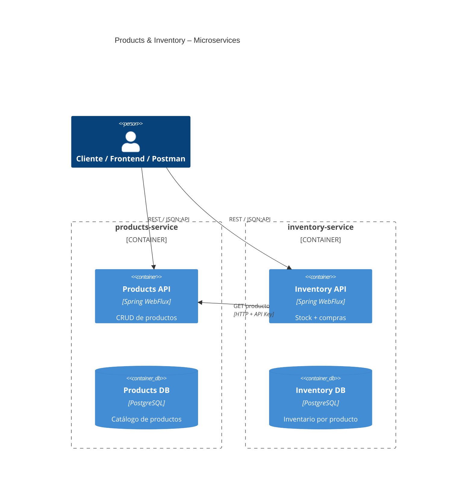
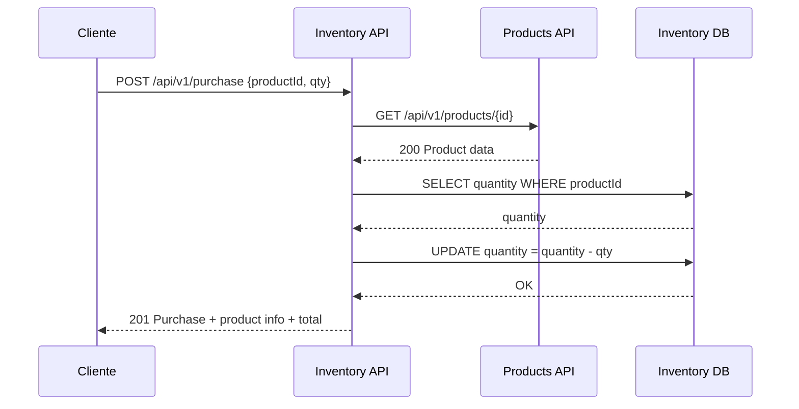

# Backend Technical Test – Products & Inventory (Spring WebFlux, Hexagonal)


> **Tecnologías clave:** Spring Boot 3.x, Spring WebFlux (reactivo), R2DBC, PostgreSQL, Docker / Docker Compose, JSON\:API, OpenAPI, GitFlow, Testcontainers.
> **Repositorios incluidos:** `products` y `inventory` (cada uno con arquitectura hexagonal).
---

## Tabla de Contenidos

1. [Resumen del Objetivo](#resumen-del-objetivo)
2. [Decisiones Clave de Arquitectura](#decisiones-clave-de-arquitectura)
3. [Arquitectura General](#arquitectura-general)
4. [Arquitectura Hexagonal por Microservicio](#arquitectura-hexagonal-por-microservicio)

   * [Products](#products)
   * [Inventory](#inventory)
5. [Modelo de Dominio](#modelo-de-dominio)
6. [Diseño del Flujo de Compra](#diseño-del-flujo-de-compra)
7. [Contratos de API (v1)](#contratos-de-api-v1)

   * [Convenciones JSON](#convenciones-jsonapi)[:API](#convenciones-jsonapi)
   * [Products API](#products-api)
   * [Inventory API](#inventory-api)
   * [Purchase API](#purchase-api)
8. [Autenticación Entre Servicios](#autenticación-entre-servicios)
9. [Configuración & Variables de Entorno](#configuración--variables-de-entorno)
10. [Ejecución Local (sin Docker)](#ejecución-local-sin-docker)
11. [Ejecución con Docker Compose](#ejecución-con-docker-compose)
12. [Testing](#testing)
13. [Estrategia de Versionamiento](#estrategia-de-versionamiento)
14. [GitFlow & Branching](#gitflow--branching)
15. [Observabilidad: Logs, Health, Métricas](#observabilidad-logs-health-métricas)
16. [Uso de Herramientas de IA](#uso-de-herramientas-de-ia)
17. [Roadmap y Mejoras Futuras](#roadmap-y-mejoras-futuras)
18. [Preguntas Frecuentes](#preguntas-frecuentes)
19. [Licencia](#licencia)

---

## Resumen del Objetivo

Construir 2 microservicios independientes que colaboran en un flujo de compra simple:

* **Products Service**: administra productos (crear, consultar, listar).
* **Inventory Service**: administra inventario por producto, procesa compras, y mantiene consistencia con Products.

Requisitos clave:

* Respuestas en **JSON**\*\*:API\*\*.
* Comunicación entre servicios vía HTTP + API Key.
* Manejo de timeouts y reintentos.
* Dockerizado; orquestación con Docker Compose.
* Pruebas unitarias e integración (con Testcontainers).
* Demostrar buenas prácticas de ingeniería senior: hexagonal, logs estructurados, versionamiento, documentación.

---

## Decisiones Clave de Arquitectura

| Decisión                                           | Estado   | Justificación                                                                            |
| -------------------------------------------------- | -------- | ---------------------------------------------------------------------------------------- |
| **Spring WebFlux**                                 | Adoptada | Requisito del reto; modelo reactivo y no bloqueante; escalabilidad IO-bound.             |
| **Persistencia PostgreSQL (R2DBC)**                | Adoptada | DB relacional madura; soporte reactiv0; consistencia ACID local; fácil en contenedores.  |
| **Endpoint de Compra en Inventory**                | Adoptada | Inventory es dueño del stock; reduce acoplamiento; Products permanece simple (catálogo). |
| **IDs cruzados entre agregados**                   | Adoptada | En DDD, cross-aggregate refs por ID; evita transacciones distribuidas.                   |
| **JSON**\*\*:API\*\*\*\* como contrato externo\*\* | Adoptada | Requisito; estandariza estructura de respuesta + relaciones.                             |
| **OpenAPI (springdoc)**                            | Adoptada | Generación automática de documentación por versión.                                      |
| **GitFlow + SemVer**                               | Adoptada | Claridad en releases; soporte a múltiples versiones en paralelo.                         |
| **Flyway para migraciones**                        | Adoptada | Versionamiento de esquema; reproducibilidad CI/CD.                                       |

---

## Arquitectura General

### Vista de Contenedores (C4 nivel 2 - Mermaid)



---

## Arquitectura Hexagonal por Microservicio

Cada microservicio sigue el patrón **Ports & Adapters** (Arquitectura Hexagonal). Las capas son similares:

```
┌─────────────────────────────────────────┐
│               Interfaces                │  (REST Controllers / DTO mappers / JSON:API)
├─────────────────────────────────────────┤
│             Aplicación / Use Cases      │  (Casos de uso, orquestación, transacciones)
├─────────────────────────────────────────┤
│                Dominio                  │  (Entidades, Aggregates, Value Objects, Servicios de Dominio)
├─────────────────────────────────────────┤
│            Infraestructura              │  (Adapters: R2DBC repos, WebClient, Mensajería, Config)  
└─────────────────────────────────────────┘
```

### Paquetización sugerida (ejemplo Gradle multi-module o por feature)

```
products/
  src/main/java/com/example/products/
    application/
    domain/
    infrastructure/
    interfaces/web/
inventory/
  src/main/java/com/example/inventory/
    application/
    domain/
    infrastructure/
    interfaces/web/
```

> Nota: Puedes usar un build multi-módulo Gradle en la raíz, o dos proyectos independientes versionados dentro del mismo repo. En este reto elegimos **monorepo** con build compuesto.

---

## Products

### Responsabilidad

Servicio dueño del **catálogo de productos**.

### Casos de uso mínimos

* Crear producto.
* Obtener producto por ID.
* Listar productos (paginado opcional).

### Limites

* No maneja stock ni compras.
* No conoce flujo de inventario.

### Dominio (simplificado)

```java
public final class Product {
    private final ProductId id;
    private final String name;
    private final String description; // opcional
    private final Money price;        // BigDecimal + Currency
    private final BrandId brandId;       // opcional (extensión)
    private final CategoryId categoryId; // opcional (extensión)
    // invariantes y fábricas
}
```

---

## Inventory

### Responsabilidad

Servicio dueño del **stock disponible por producto** y de la **orquestación de compras**.

### Casos de uso mínimos

* Consultar stock.
* Actualizar stock (operación administrativa o sincrónica tras compra).
* Procesar compra (descontar stock, devolver datos del producto + total).

### Limites

* No crea ni administra productos.
* Depende de Products sólo para validación y datos de lectura.

### Dominio (simplificado)

```java
public final class InventoryItem {
    private final ProductId productId;
    private final int quantity; // >= 0
    // métodos de dominio para debit/credit
}
```

---

## Modelo de Dominio

### Value Objects Comunes

* `ProductId` (UUID)
* `Money` (BigDecimal amount + Currency)
* `BrandId`, `CategoryId` (extensiones opcionales)

### Agregados

| Agregado                     | Microservicio | Raíz          | Invariantes                                     |
| ---------------------------- | ------------- | ------------- | ----------------------------------------------- |
| Product                      | products      | Product       | name requerido, price >= 0                      |
| InventoryItem                | inventory     | InventoryItem | quantity >= 0; decrementa solo si hay stock     |
| Purchase (evento / registro) | inventory     | Purchase      | referencia a ProductId + cantidad + monto total |

---

## Diseño del Flujo de Compra

### Racional: ¿Por qué vive en Inventory?

* Inventory posee el stock y debe garantizar consistencia al debitar.
* Products se mantiene como catálogo limpio y escalable.
* El flujo requiere leer datos de producto pero escribir sólo en inventario.

### Secuencia (Mermaid)



### Consideraciones de Consistencia

* *Check-then-act* protegido en capa de aplicación (optimistic update con versión o `WHERE quantity >= ?`).
* Transacción reactiva en DB local.
* Productos sólo lectura → no hay transacción distribuida.

---

## Contratos de API (v1)

> Todas las rutas están namespaced bajo `/api/v1` en cada servicio.

### Convenciones JSON\:API

* Respuesta envuelta en `{ "data": { ... } }`.
* Errores en `{ "errors": [ {"status":..., "title":..., "detail":...} ] }`.
* Relaciones en `relationships` con `{ "data": {"type":..., "id":...} }`.
* Atributos dentro de `attributes`.

Ejemplo genérico:

```json
{
  "data": {
    "type": "product",
    "id": "<uuid>",
    "attributes": {
      "name": "Teclado Mecánico",
      "description": "RGB switch blue",
      "price": { "amount": "120.00", "currency": "USD" }
    },
    "relationships": {
      "brand": { "data": { "type": "brand", "id": "<uuid>" } },
      "category": { "data": { "type": "category", "id": "<uuid>" } }
    }
  }
}
```

---

### Products API

**POST /api/v1/products**

* Crea un producto.
* Body:

```json
{
  "data": {
    "type": "product",
    "attributes": {
      "name": "Laptop 14",
      "description": "Equipo liviano",
      "price": { "amount": "1500.00", "currency": "USD" },
      "brandId": "...",        // opcional
      "categoryId": "..."       // opcional
    }
  }
}
```

* Respuestas: `201 Created` + JSON\:API.

**GET /api/v1/products/{id}** → 200 / 404.

**GET /api/v1/products?size=\&page=** (paginado opcional).

---

### Inventory API

**GET /api/v1/inventory/{productId}**

* Devuelve cantidad disponible e información de producto embebida opcional (`include=product`).

**PUT /api/v1/inventory/{productId}**

* Actualiza cantidad absoluta (admin).
* Body:

```json
{
  "data": {
    "type": "inventory",
    "id": "<productId>",
    "attributes": {
      "quantity": 120
    }
  }
}
```

---

### Purchase API

**POST /api/v1/purchase** (Inventory Service)

Body mínimo:

```json
{
  "data": {
    "type": "purchase",
    "attributes": {
      "productId": "<uuid>",
      "quantity": 2
    }
  }
}
```

Respuesta:

```json
{
  "data": {
    "type": "purchase",
    "id": "<purchaseId>",
    "attributes": {
      "productId": "<uuid>",
      "productName": "Laptop 14",
      "unitPrice": { "amount": "1500.00", "currency": "USD" },
      "quantity": 2,
      "total": { "amount": "3000.00", "currency": "USD" },
      "purchasedAt": "2025-07-21T18:15:00Z"
    },
    "relationships": {
      "product": { "data": { "type": "product", "id": "<uuid>" } }
    }
  }
}
```

Errores esperados:

* 404 product not found.
* 409 insufficient inventory.
* 503 products-service unavailable (reintentado X veces).

---

## Autenticación Entre Servicios

Simple API Key via header:

```
X-API-Key: ${PRODUCTS_INTERNAL_API_KEY}
```

* Cada servicio valida la key entrante en un `WebFilter` reactivo.
* Claves se inyectan vía variables de entorno.
* Rotación: soportar múltiples claves válidas (lista separada por comas).

---

## Configuración & Variables de Entorno

Cada microservicio lee configuración de entorno + propiedades por perfil (`dev`, `test`, `prod`). A continuación la matriz de variables mínimas.

### Variables comunes

| Variable                 | Descripción | Ejemplo (dev)                  |
| ------------------------ | ----------- | ------------------------------ |
| `DB_HOST`                | Host DB     | `localhost`                    |
| `DB_PORT`                | Puerto DB   | `5432`                         |
| `DB_NAME`                | Nombre DB   | `products_db` / `inventory_db` |
| `DB_USER`                | Usuario     | `postgres`                     |
| `DB_PASSWORD`            | Password    | `postgres`                     |
| `SPRING_PROFILES_ACTIVE` | Perfil      | `dev`                          |

### Products-specific

| Variable      | Descripción | Ejemplo |
| ------------- | ----------- | ------- |
| `SERVER_PORT` | Puerto HTTP | `8081`  |

### Inventory-specific

| Variable               | Descripción               | Ejemplo                            |
| ---------------------- | ------------------------- | ---------------------------------- |
| `SERVER_PORT`          | Puerto HTTP               | `8082`                             |
| `PRODUCTS_SERVICE_URL` | URL interna para Products | `http://products:8081` (en Docker) |
| `PRODUCTS_API_KEY`     | API key compartida        | `changeme`                         |

---

## Ejecución Local (sin Docker)

### Requisitos previos

* JDK 21+
* Docker *opcional* (para Postgres local vía contenedor)
* Gradle Wrapper (`./gradlew`)

### Pasos rápidos

```bash
# 1. Levanta PostgreSQL (opcional, usa docker local)
docker run --name pg -e POSTGRES_PASSWORD=postgres -e POSTGRES_DB=products_db -p 5432:5432 -d postgres:16

# 2. Exporta variables (Products)
export SPRING_PROFILES_ACTIVE=dev
export DB_NAME=products_db
# etc...

# 3. Ejecuta Products
dcd products
./gradlew bootRun

# 4. Ejecuta Inventory (usa otro puerto)
cd ../inventory
export PRODUCTS_SERVICE_URL=http://localhost:8081
./gradlew bootRun
```

---

## Ejecución con Docker Compose

En la raíz del repo:

```
├─ docker-compose.yml
├─ products/
├─ inventory/
```

`docker-compose.yml` (fragmento ilustrativo):

```yaml
services:
  db-products:
    image: postgres:16
    environment:
      POSTGRES_PASSWORD: postgres
      POSTGRES_DB: products_db
    ports: ["5433:5432"]
  db-inventory:
    image: postgres:16
    environment:
      POSTGRES_PASSWORD: postgres
      POSTGRES_DB: inventory_db
    ports: ["5434:5432"]
  products:
    build: ./products
    environment:
      SPRING_PROFILES_ACTIVE: docker
      DB_HOST: db-products
      DB_NAME: products_db
      DB_PASSWORD: postgres
    depends_on: [db-products]
    ports: ["8081:8080"]
  inventory:
    build: ./inventory
    environment:
      SPRING_PROFILES_ACTIVE: docker
      DB_HOST: db-inventory
      DB_NAME: inventory_db
      DB_PASSWORD: postgres
      PRODUCTS_SERVICE_URL: http://products:8080
      PRODUCTS_API_KEY: local-dev-key
    depends_on: [db-inventory, products]
    ports: ["8082:8080"]
```

Ejecutar:

```bash
docker compose up --build
```

---

## Testing

### Tecnologías

* **JUnit 5 + AssertJ**
* **Spring WebFlux WebTestClient** para pruebas de controlador reactivo.
* **Mockito / Mockk** (o Reactor Test) para puertos externos.
* **Testcontainers** para PostgreSQL real en integración.

### Cobertura objetivo

* **≥ 80%** líneas + lógica crítica.

### Qué se prueba

| Área                 | Tipo              | Escenarios                                                        |
| -------------------- | ----------------- | ----------------------------------------------------------------- |
| Creación de producto | Unit / Web        | happy path, validaciones de nombre/precio                         |
| Consulta producto    | Unit / Web        | 200, 404                                                          |
| Inventario consulta  | Unit / Web        | producto válido, error producto inexistente                       |
| Compra               | App / Integration | stock suficiente, insuficiente, product 404, timeout products-svc |
| Comunicación         | Integration       | inventory -> products (mock server o WireMock)                    |

### Comandos

```bash
# Ejecutar todas las pruebas (raíz del repo)
./gradlew clean test

# Reporte de cobertura (Jacoco)
./gradlew jacocoTestReport
```

---

## Estrategia de Versionamiento

Ver detalle en la sección técnica de arquitectura; resumen operativo:

### 1. Versionamiento de API

* Prefijo de versión en ruta: `/api/v1/...`.
* Cambios incompatibles → nueva ruta `/api/v2/...`.
* Soporte paralelo por periodo de gracia.

### 2. Versionamiento de Esquema de Datos

* **Flyway** en cada microservicio.
* Archivos: `src/main/resources/db/migration/V1__init.sql`, `V2__add_brand_category.sql`, etc.
* Migraciones ejecutadas al arrancar contenedor.

### 3. Versionamiento de Artefactos / Contenedores

* **SemVer** para imágenes Docker (`1.0.0`, `1.1.0`, `2.0.0`).
* Tag `latest` sólo en dev.

### 4. Compatibilidad Contractual

* Contratos OpenAPI versionados por tag (`/v1/api-docs`).
* Publicar diffs en CHANGELOG.

---

## GitFlow & Branching

```
main        # releases productivos taggeados
│
└─ develop  # integración continua
   ├─ feature/<name>
   ├─ bugfix/<name>
   ├─ release/<version>
   └─ hotfix/<version>
```

### Convenciones de Commit (Conventional Commits)

* `feat: agrega endpoint de compra`
* `fix: corrige validación de precio`
* `refactor: extrae mapper dominio`
* `test: agrega pruebas de inventario insuficiente`

Automatizable con `semantic-release` o plugin Gradle.

---

## Observabilidad: Logs, Health, Métricas

* **Spring Boot Actuator** habilitado (`/actuator/health`, `/actuator/info`).
* **Logs estructurados JSON** (Logback + encoder JSON) para envío a ELK/Graylog.
* **MDC correlation-id** por request para rastrear flujos cross-service.
* Métricas Micrometer → Prometheus (opcional).

---

## Uso de Herramientas de IA

Se documenta el uso intencional de IA como apoyo, no como sustituto de criterio técnico:

| Herramienta    | Uso                                               | Validación                         |
| -------------- | ------------------------------------------------- | ---------------------------------- |
| ChatGPT        | Generación inicial de código boilerplate y README | Revisión manual, pruebas unitarias |
| GitHub Copilot | Autocompletado en clases DTO/mappers              | PR review humana                   |
| SonarLint + AI | Sugerencias de code smell                         | Build falla si calidad < umbral    |

> **Recomendación de transparencia:** Incluye en `docs/ai-usage.md` los prompts clave y ajustes manuales.

---

## Roadmap y Mejoras Futuras

* Soporte de **Brand** y **Category** como catálogos independientes.
* **Eventos de dominio** al cambiar inventario (RabbitMQ / Kafka) → analytics, alertas low-stock.
* **Circuit Breaker** (Resilience4j) en llamadas a Products.
* **Cache local** de productos en Inventory para resiliencia.
* **Autenticación OAuth2/JWT** en lugar de API Key simple.
* **Escalamiento horizontal** con Kubernetes (readiness/liveness probes).

---

## Preguntas Frecuentes

**¿Por qué no transacción distribuida entre Products e Inventory?**
Porque cada uno es dueño de su dato; el flujo de compra sólo escribe en Inventory. La info de producto se lee y se devuelve al cliente; si cambia un precio en Products, nuevas compras usarán el precio actualizado.

**¿Qué pasa si Products está caído?**
Inventory retorna error 503 tras reintentos configurados. (Opcional: cache último snapshot del producto.)

**¿Puedo crear un producto y stock en un solo paso?**
No en la versión base; crea producto en Products y luego inicializa stock en Inventory. Esto preserva límites de responsabilidad.

---

**¡Gracias!** Si tienes preguntas, abre un issue o escribe en la discusión del repositorio.
